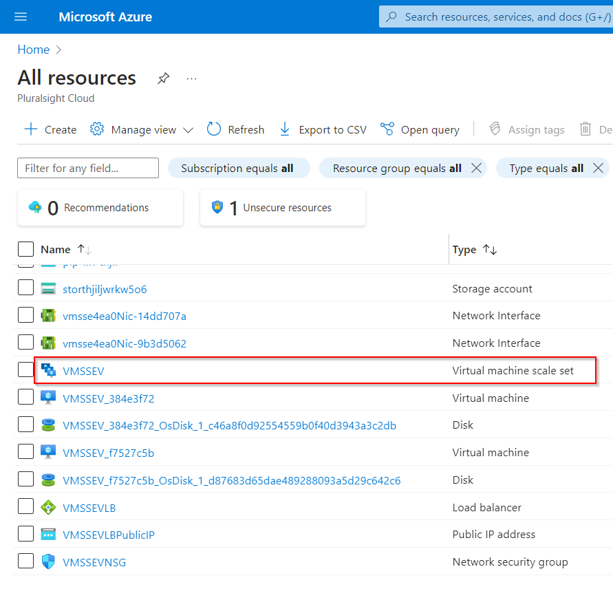

# Using Custom Images for a Virtual Machine Scale Set in Azure

**There are 4 objectives with this lab:**
* Start Cloud Shell
* Set Resource Variables in Cloud Shell
* Create an Image from the VM
* Create a Virtual Machine Scale Set from an Image

## Start Cloud Shell

In the first part of the lab, we'll need to get the Azure CLI up and running. For this lab, we'll be using Bash instead of PowerShell (PS) so some of the commands will be different. One thing I do want to make sure you guys do is create your Azure CLI session in the same location as the resources in your resource group (RG). That will save you the headache of having to specify the location for each of your image resources. I didn't know that at first.  

That completes the first objective of this lab! On to objective 2. 

## Set Resource Variables in Cloud Shell

For the second portion of this lab, we're going to create the RG and virtual machine (VM) image variables for our Bash session. In the portal, copy your resource group name and put it somewhere like a notepad file. We'll also do the same thing with our VM. Go to VM and on the lefthand side, go to Settings > Properties. Scroll down and you'll find the Resource ID. Copy and paste this as well. 

We'll need to create a variable for both the RG and VM image. The syntax is a little different in Bash than PS so make sure you have an variable name, no space inbetween the variable name, '=" sign, and variable value, and then put an apostrophe at the beginning and end of the variable value. 

If you want to check the value of the variable, use `echo $<VARIABLE NAME>` and it give an output that is equal to your variable value. 

That completes the second objective. Lets move to the 3rd one. 

## Create an Image from the VM

Now, we have to create the image gallery, definition, and version for the virtual machine scale set (VMSS) to be built from. All of these properties will come from the `linVM` we just used in the portal. So I used a website to find all the commands for each resource ([link here](https://learn.microsoft.com/en-us/cli/azure/sig?view=azure-cli-latest)). You can find all the commands there. 

We'll create the image gallery first. We need to give the gallery a name so I used the generic name on the website and added a few numbers to the end of it. The lab told me to add the numbers on the end. After inputting your command, you should be show some output that lets you know Bash accepted it. 

Also, you can go to All Resources (not your RG) to see if the Image Gallery was created. 

I had to add the location onto my command because at first, I accidentally put my Bash session in East US instead of West US where my VM was located. 

Now, lets create the image definition. Use the same Microsoft page but I want to point out one thing. You'll have to use the `Specialized` argument instead of the `Generalized` argument or Bash won't accept your command. Other than that, nothing should break your command. I changed the Publisher, Owner, and SKU arguments to something less generic. I also kept the `--gallery-image-definition` very generic as well. I just added some numbers on the end of it as well. 

Once Bash has accepted your command, you'll see it pop up in the All Resources page (remember, it will not show in the RG page). 

Last but not least, lets create the image version. Now, THIS is wear I ran into issues for a long time and why I specified to make sure you use the `--Specialized` argument instead of the `--Generalized` argument. Bash will not accept this command unless your argument matches the `osState` that your VM has. This wasn't a big issue because eventually I figured it out but it became a problem when I started to create the VMSS in the next objective. 

So, with the hard part out of the way, I gave the image version `1.0.0` and the we'll pass the `$IMAGE` variable from our `linVM` as the VM we'll be using for argument `--virtual-machine`. Also, this command takes A LONG time to complete so hang tight. I think it took me about 15 minutes. 

Once the command is completed, you can find the image version resource in the All Resources page. 

Now we're done with Objective 3. Lets move on to the final objective. 

## Create a Virtual Machine Scale Set from an Image

Now, we need to create the VMSS from the image gallery that we've created. Lets revisit the `$IMAGE` variable and give it a new value. Navigate to the image definition resource. Go to Settings > Properties and then copy its Resource ID. We're going to use this value as the new `$IMAGE` value. 

We're going to use this value as the new `$IMAGE` value. So lets do what we did the first time. 

Now, we need to create the VMSS from the image definition. I found the commands in a Microsoft article ([link here](https://learn.microsoft.com/en-us/azure/virtual-machine-scale-sets/quick-create-cli)).

Now, this was the biggest headache of the entire lab. I didn't originally have the `--specialized` argument in the command and I couldn't for the life of me figure out that this was required. This was mainly because in the Microsoft article, it didn't show that this was an acceptable argument. So unfortunately, I did have to look at the solution for this part. But after that was done, all the VMSS were populated in the All Resources tab!

Lab completed!

## Personal Notes

This lab wasn't bad but I do need to go over why you need an image gallery, image definition, and image version. Now, thought would be is your image gallery holds all the images that you want to reference. The image definition is the actual like, IaC for the VM that you want to use. Lastly, the image version is so you can keep track of any changes and updates to an image definition. My thing is, why do all of these things need to be separated? So I'm going to go over the solution because he actually explains the necessity for each resource. I just didn't need it at the time.

Also, that Specialized vs. Generalized issue was the bane of my existence yesterday. I'll also figure out whats the difference. 

